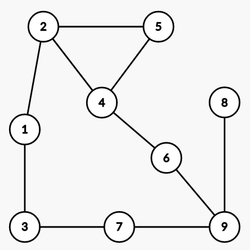

# basic_RL_Q-learning

This is a very simple example of reinforcement learning using Q-learning where an agent is trained to find the shortest path from one vertex to another in a graph.
The agent is learning to go from vertex 1 to vertex 9 in this undirected graph:

Credit: https://www.simplilearn.com/tutorials/machine-learning-tutorial/what-is-q-learning
