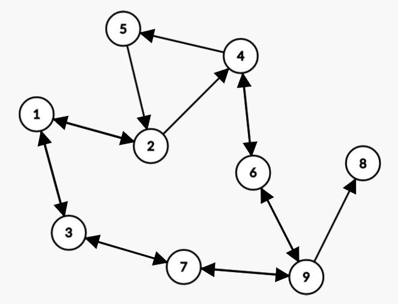

# shortest_path_Q-learning

This is a very simple example of reinforcement learning using Q-learning where an agent is trained to find the shortest path between 2 vertices in the following directed graph: 

Credit: https://www.simplilearn.com/tutorials/machine-learning-tutorial/what-is-q-learning
